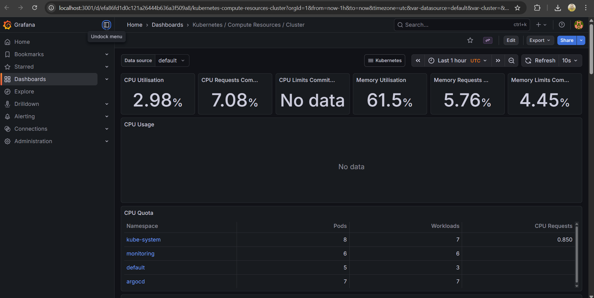

# 🚀 Cloud-Native DevOps Platform: Full-Stack GitOps Implementation


## 📖 Project Overview
This repository hosts a complete **End-to-End DevOps Project** demonstrating a modern, distributed microservices architecture. The goal was to migrate a legacy monolithic workflow into a robust **Kubernetes** platform managed via **GitOps** principles.

The system features a 3-tier web application (React, Node.js, PostgreSQL) fully automated with a CI/CD pipeline, self-healing infrastructure, and real-time observability.

---

## 🏗 Architecture & Workflow

### 1. The Application Stack
* **Frontend:** React.js application (served via Nginx).
* **Backend:** Node.js/Express REST API.
* **Database:** PostgreSQL (StatefulSet with Persistent Volume Claims).

### 2. The DevOps Pipeline
The project implements a fully automated "Commit-to-Deploy" workflow:

1.  **Continuous Integration (CI):**
    * Developer pushes code to GitHub.
    * **Jenkins** detects changes, builds Docker images for Frontend/Backend.
    * Images are tagged (versioned) and pushed to **Docker Hub**.
2.  **Continuous Deployment (CD):**
    * **ArgoCD** watches the GitHub Kubernetes manifests.
    * When the manifest is updated (e.g., new image tag), ArgoCD automatically syncs the cluster state.
    * Zero-downtime deployments are handled via Kubernetes Rolling Updates.

---

## 🛠 Tech Stack

| Category | Technologies |
| :--- | :--- |
| **Orchestration** | Kubernetes (Minikube), Docker |
| **CI / Build** | Jenkins (Docker-in-Docker Pipeline), Git |
| **CD / GitOps** | ArgoCD |
| **Monitoring** | Prometheus, Grafana, Alertmanager (via Helm) |
| **Application** | React.js, Node.js, PostgreSQL |
| **Infrastructure** | Helm Charts, YAML Manifests |

---

## 📸 Screenshots

### **GitOps Dashboard (ArgoCD)**
*Visualizing the application topology and sync status.*

*(Note: Replace this path with your actual image or delete this line)*

### **Observability (Grafana)**
*Real-time monitoring of Cluster CPU, Memory, and Pod health.*

*(Note: Replace this path with your actual image or delete this line)*

---

## 🚀 How to Run Locally

### Prerequisites
* Docker Desktop & Minikube installed.
* `kubectl` and `helm` CLIs configured.

### Quick Start
1.  **Start Minikube**
    ```bash
    minikube start
    ```

2.  **Deploy with ArgoCD**
    ```bash
    # Create the namespace and apply the Application manifest
    kubectl create namespace argocd
    kubectl apply -f [https://raw.githubusercontent.com/argoproj/argo-cd/stable/manifests/install.yaml](https://raw.githubusercontent.com/argoproj/argo-cd/stable/manifests/install.yaml)
    kubectl apply -f k8s/argocd-app.yaml
    ```

3.  **Access the Application**
    ```bash
    minikube service frontend
    ```

---

## 📈 Future Improvements
* Implement **Chaos Engineering** to test resilience.
* Migrate secrets management to **HashiCorp Vault**.
* Deploy to a public cloud provider (AWS EKS or Google GKE).